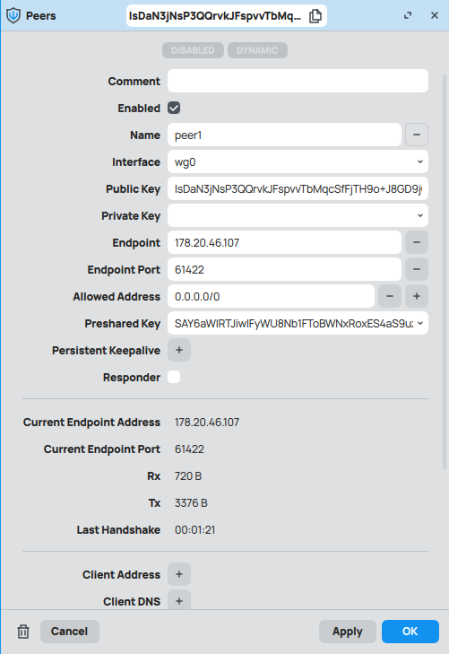
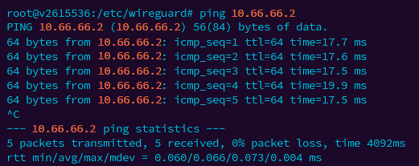

University: [ITMO University](https://itmo.ru/ru/)  
Faculty: [FICT](https://fict.itmo.ru)  
Course: [Network programming](https://github.com/itmo-ict-faculty/network-programming)  
Year: 2024/2025  
Group: K34212  
Author: Polina Zvoda  
Lab: Lab1  
Date of create: 01.09.2024  
Date of finished: 29.09.2024

## Лабораторная работа №1 "Установка CHR и Ansible, настройка VPN"

## Описание

Данная работа предусматривает обучение развертыванию виртуальных машин (VM) и системы контроля конфигураций Ansible а также организации собственных VPN серверов.

## Цель работы

Целью данной работы является развертывание виртуальной машины на базе платформы Microsoft Azure с установленной системой контроля конфигураций Ansible и установка CHR в VirtualBox.

## Ход работы

Для выполнения лабораторной работы мною принято решение воспользоваться сервисом VDSina для приобретения сервера.

Вторым шагом мною были установлены необходимые компоненты, а именно python3 и Ansible.

Затем мною была установлена виртуальная машина на RouterOS в VirtualBox.

После чего, был установлен Wireguard, созданы публичный и приватный ключ, а также файл конфигурации wg0.conf.

Далее был поднят интерфейс.

И в заключении, со стороны клиента в WinBox был настроен интерфейс Wireguard, в котором был указан приватный ключ и порт доступа от интерфейса.

После чего, было проведенено тестирование: 

- Пинг клиент - сервер

- Проверка интернет соединения

- Пинг сервер - клиент

- Проверка интернет соединения

## Вывод

В ходе выполнения лабораторной работы был поднят удалённый сервер на платформе VDSina, на нем установлены система контроля конфигураций python и Ansible, также была поднята виртуальная машина на RouterOS в VirtualBox. В данных устройствах был поднят Wireguard интерфейс и настроен тоннель между ними.