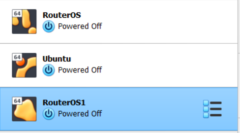
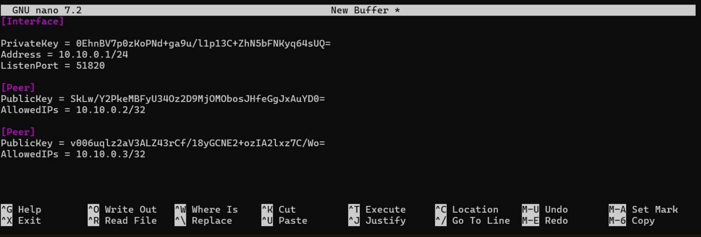
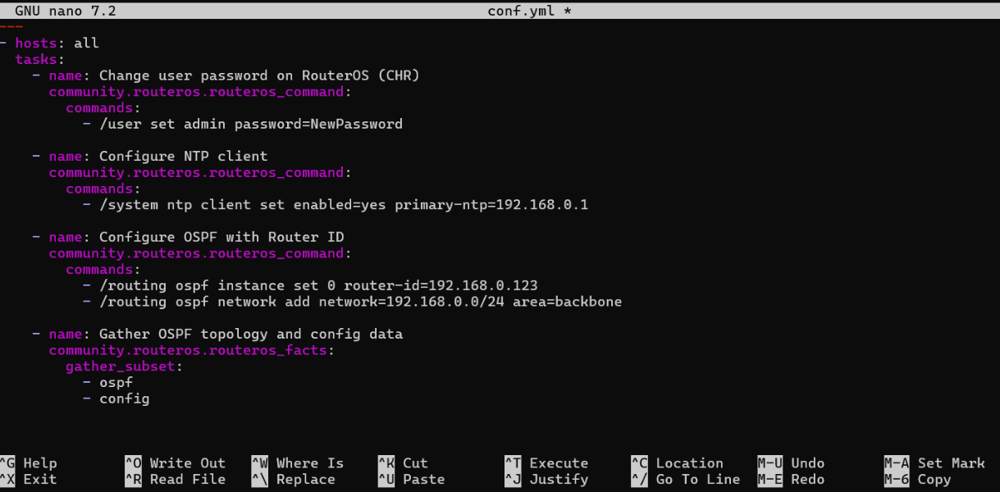
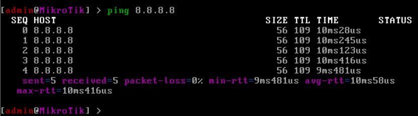
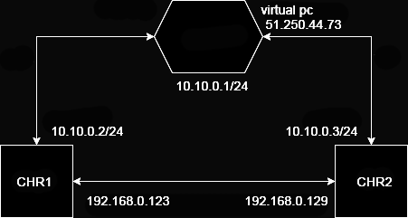

University: [ITMO University](https://itmo.ru/ru/)  
Faculty: [FICT](https://fict.itmo.ru)  
Course: [Network programming](https://github.com/itmo-ict-faculty/network-programming)  
Year: 2024/2025  
Group: K34212  
Author: Polina Zvoda  
Lab: Lab2  
Date of create: 01.10.2024  
Date of finished: 18.10.2024

## Лабораторная работа №2 "Развертывание дополнительного CHR, первый сценарий Ansible"

## Цель работы

С помощью Ansible настроить несколько сетевых устройств и собрать информацию о них. Правильно собрать файл Inventory.

## Ход работы

1. Установка второго CHR.



2. Был создан OVPN клиент для нового CHR аналогично первой лабораторной работе. Использовались стандартные команды для настройки интерфейса и подключения к серверу.



3. Создание файла inventory.yaml, содержащего информацию об узлах, на которых следует производить настройку (описывающий необходимые параметры для подключения и настройки ntp, ospf) для Ansible.

```
all:
  hosts:
    CHR1:
      ansible_host: 192.168.0.123
      ansible_user: admin
      ansible_password: 1111
      ansible_connection: ssh
      ansible_ssh_common_args: '-o StrictHostKeyChecking=no'
    CHR2:
      ansible_host: 192.168.0.129
      ansible_user: admin
      ansible_password: 222
      ansible_connection: ssh
      ansible_ssh_common_args: '-o StrictHostKeyChecking=no'
```

4. Была осуществлена настройка логина и пароля на обоих CHR с помощью Ansible.

```
- hosts: all
  tasks:
    - name: Change user password on RouterOS (CHR)
      community.routeros.command:
        commands:
          - /user set name=admin password=newpassword
```

5. Настройка NTP-клиента на обоих CHR, чтобы обеспечить синхронизацию времени.

```
- hosts: all
  tasks:
    - name: Set NTP client
      community.routeros.command:
        commands:
          - /system ntp client set enabled=yes primary-ntp=91.206.8.50 secondary-ntp=193.204.114.232
```

6. Была произведена настройка Open Shortest Path First с указанием Router ID для 2х роутеров.

```
- hosts: all
  tasks:
    - name: Set OSPF Router ID
      community.routeros.command:
        commands:
          - /routing ospf instance set default router-id=1.1.1.1
          - /routing ospf network add network=192.168.0.0/24 area=backbone
```

7. Данные по OSPF топологии.





## Результаты



## Вывод:

В ходе выполнения данной лабораторной работы был настроен OSPF через WireGuard на MikroTik, NTP Client и авторизация с помощью Ansible.
