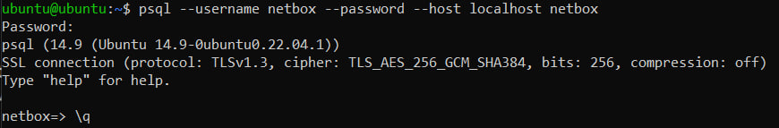
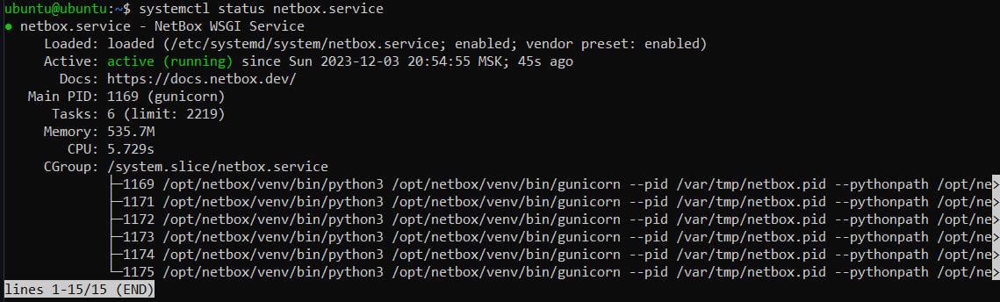
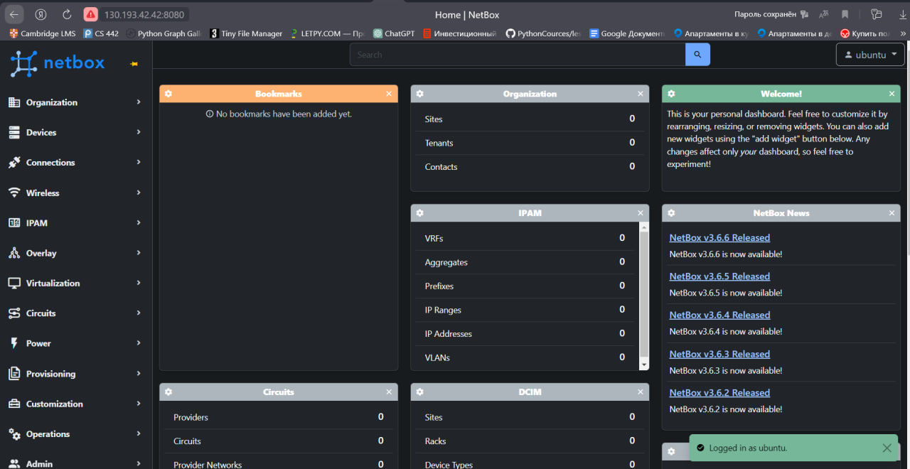
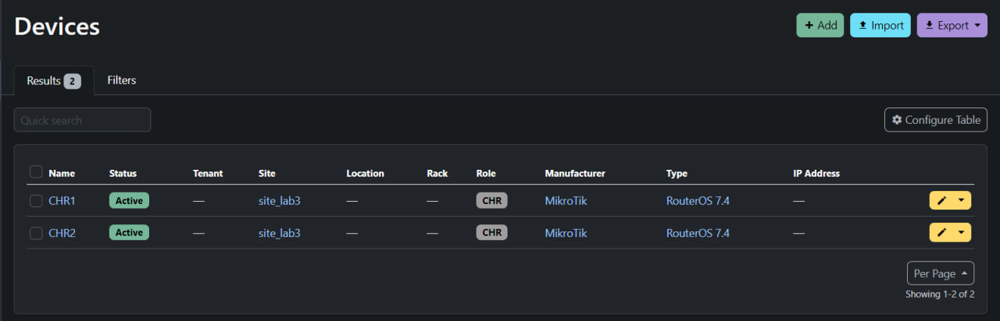
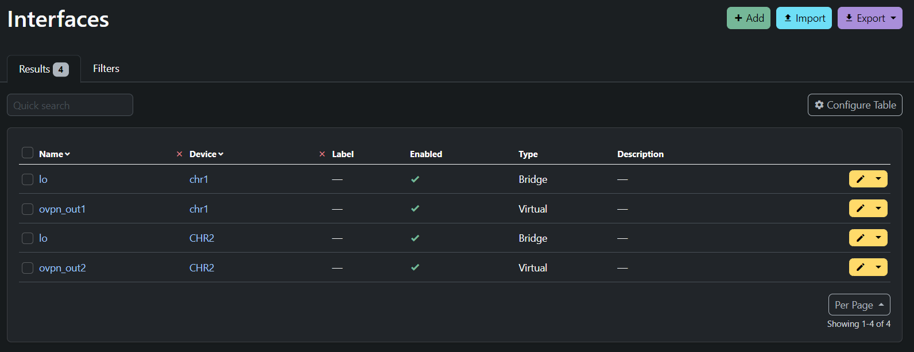
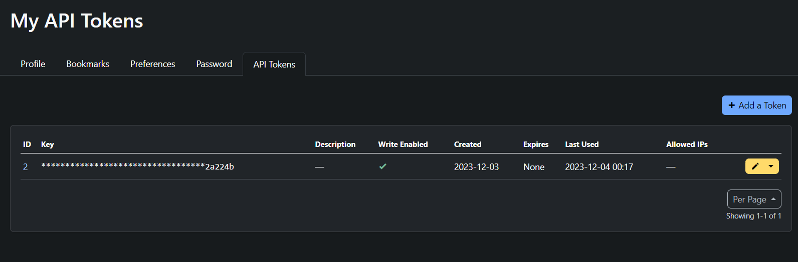
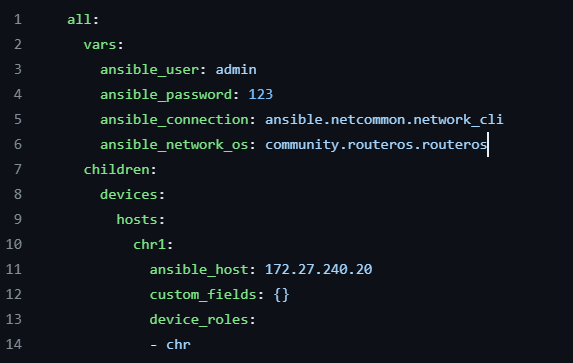
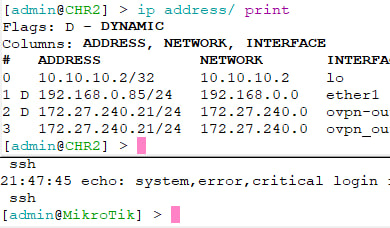
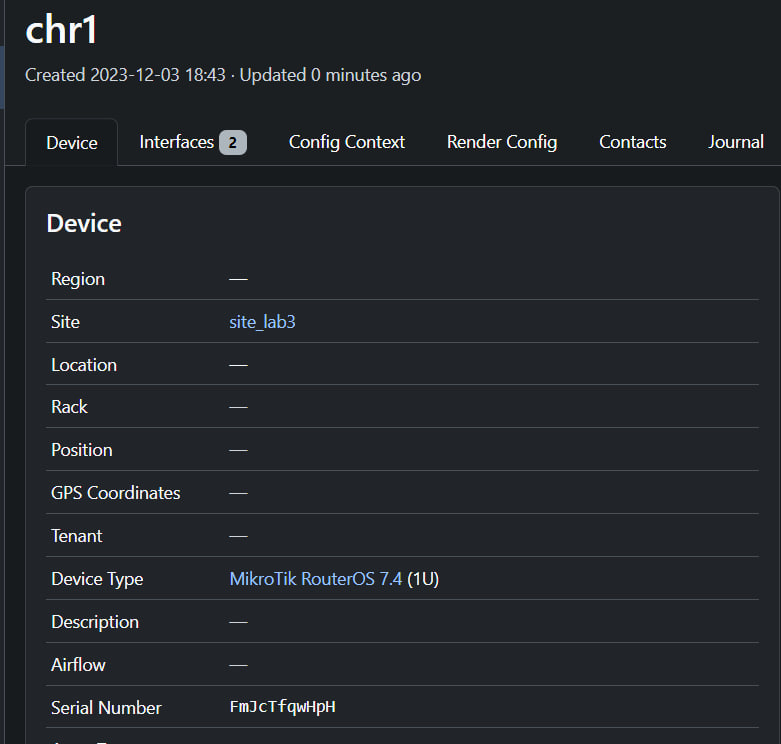
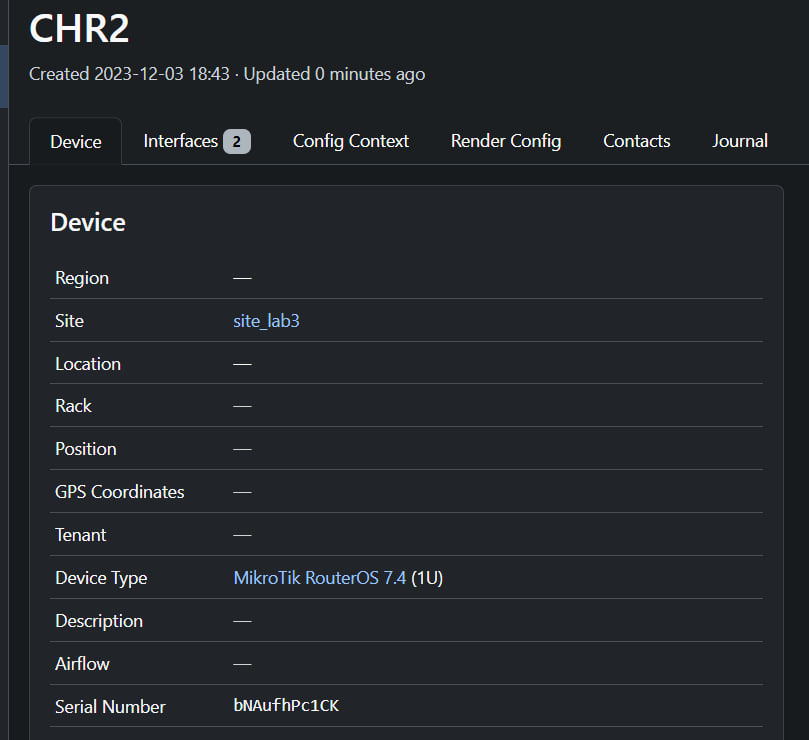

University: [ITMO University](https://itmo.ru/ru/)  
Faculty: [FICT](https://fict.itmo.ru)  
Course: [Network programming](https://github.com/itmo-ict-faculty/network-programming)  
Year: 2024/2025  
Group: K34212  
Author: Polina Zvoda  
Lab: Lab3
Date of create: 19.10.2024  
Date of finished: 05.11.2024

## Лабораторной работе 3 "Развертывание Netbox, сеть связи как источник правды в системе технического учета Netbox"

## Цель работы:  
С помощью Ansible и Netbox собрать всю возможную информацию об устройствах и сохранить их в отдельном файле.

### Ход работы

Для того, чтобы поднять Netbox сначала был установлен и настроен PostgreSQL:

```
sudo apt install postgresql libpq-dev -y
```

Создание БД и юзера:

```
CREATE DATABASE netbox;
CREATE USER netbox WITH ENCRYPTED password '123';
GRANT ALL PRIVILEGES ON DATABASE netbox to netbox;
```



Далее устанавливаемн Redis с помощью команды:

```
sudo apt install -y redis-server
```

Установка и создание каталога NetBox:

```
sudo apt install python3 python3-pip python3-venv python3-dev build-essential libxml2-dev libxslt1-dev libffi-dev libpq-dev libssl-dev zlib1g-dev git -y
sudo pip3 install --upgrade pip

sudo mkdir -p /opt/netbox/ && cd /opt/netbox/
sudo git clone -b master https://github.com/netbox-community/netbox.git .
```

Создание юзера netbox и настройка:

```
sudo adduser --system --group netbox
sudo chown --recursive netbox /opt/netbox/netbox/media/
```

Копируем конфигурационный файл и Генерируем ключ:

```
sudo cp configuration.example.py configuration.py
sudo ln -s /usr/bin/python3 /usr/bin/python
sudo /opt/netbox/netbox/generate_secret_key.py
```

Далее настроим конфигурационный файл:

```
ALLOWED_HOSTS = ['*']
DATABASE = {
    'NAME': 'netbox',
    'USER': 'netbox',
    'PASSWORD': '123',
    'HOST': 'localhost',
    'PORT': '',
    'CONN_MAX_AGE': 300,
}

SECRET_KEY = 'ключ'
```

Для дальнейшей настройки были выполнены следующие команды:  
Создание виртуальной среды и настройка пакетов, также создаем юзера, чтобы заходить через него в NetBox

```
sudo /opt/netbox/upgrade.sh
source /opt/netbox/venv/bin/activate
cd /opt/netbox/netbox
python3 manage.py createsuperuser
```

Установка Gunicorn

```
sudo cp /opt/netbox/contrib/gunicorn.py /opt/netbox/gunicorn.py
sudo cp /opt/netbox/contrib/*.service /etc/systemd/system/
sudo systemctl daemon-reload
```

Start netbox и проверка:

```
sudo systemctl start netbox netbox-rq
sudo systemctl enable netbox netbox-rq
```



Также был настроен веб-сервер Nginx для доступа к Netbox через браузер:

```
sudo apt install -y nginx
sudo cp /opt/netbox/contrib/nginx.conf /etc/nginx/sites-available/netbox
sudo rm /etc/nginx/sites-enabled/default
sudo ln -s /etc/nginx/sites-available/netbox /etc/nginx/sites-enabled/netbox
```

---

### Настройка Netbox в браузере.



В Netbox Был создан сайт, сами устройства – chr1 и CHR2 и интерфейсы с IP-адресами.





И создаем API-токен для дальнейшего задания:



Работа с Ansible. Установка netbox.netbox

```
ansible-galaxy collection install netbox.netbox
```

Создаем inventory-файл для сохранения всех данных

```
plugin: netbox.netbox.nb_inventory
api_endpoint: http://130.193.42.42:8080/
token: "токен"
validate_certs: False
config_context: False
interfaces: True
```

Сохранение данных в nb_inventory.yml

```
ansible-inventory -v --list -y -i netbox_inventory.yml > nb_inventory.yml
```

### Сценарий для настройки CHR на основе Netbox.

В полученный файл добавляем переменные для подключения к устройствам.
Измененный файл: [inventory.yml](nb_inventory.yml)



С помощью playbook изменяем имя, а также добавляем IP-адреса на устройство:

```
- name: Configuration
  hosts: devices
  tasks:
    - name: Set Name
      community.routeros.command:
        commands:
          - /system identity set name="{{interfaces[0].device.name}}"
    - name: Set IP-address
      community.routeros.command:
        commands:
        - /interface bridge add name="{{interfaces[1].display}}"
        - /ip address add address="{{interfaces[1].ip_addresses[0].address}}" interface="{{interfaces[1].display}}"
```

После запуска playbook изменения успешно выполнены. Имена устройств изменились, а также добавились адреса на новый созданный интерфейс:

<p style="display: inline;">


</p>
### Сбор серийных номеров CHR

Измененный playbok для сбора серийных номеров устройств и внесении их в Netbox

```
- name: Serial Numbers
  hosts: devices
  tasks:
    - name: Serial Number
      community.routeros.command:
        commands:
          - /system license print
      register: license
    - name: Add Serial Number
      netbox_device:
        netbox_url: http://130.193.42.42:8080/
        netbox_token: созданный_токен
        data:
          name: "{{interfaces[0].device.name}}"
          serial: "{{license.stdout_lines[0][0].split(' ').1}}"
        state: present
        validate_certs: False
```

После запуска playbook в Netbox можно увидеть добавленный серийный номер для каждого CHR:

<p style="display: inline;">


</p>
---

### Вывод

В ходе выполнения данной лабораторной работы была собрана информация об устройствах, которая была сохранена в отдельном файле с помощью Ansible и Netbox, а также была произведена настройка CHR на основе собранных данных.
