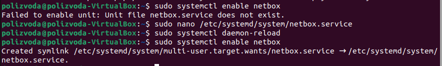
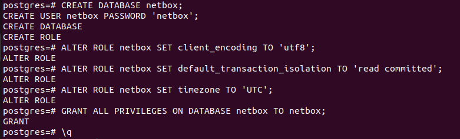
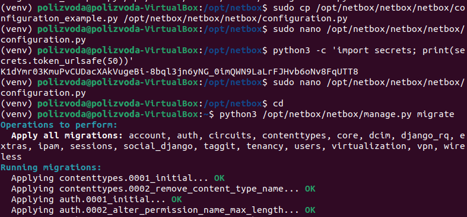
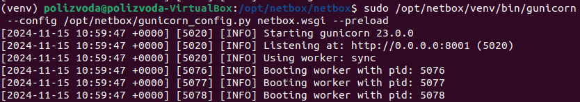
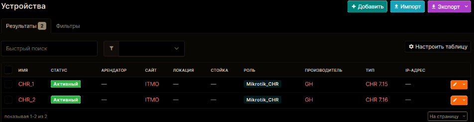
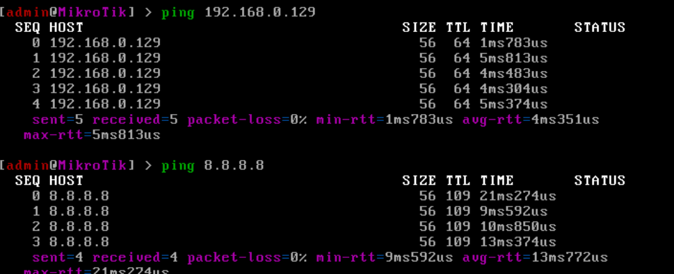
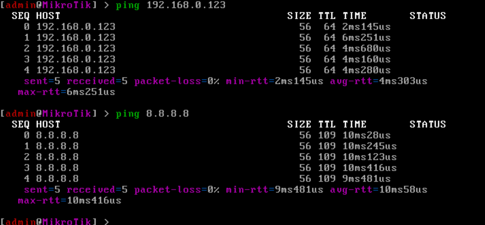

University: [ITMO University](https://itmo.ru/ru/)  
Faculty: [FICT](https://fict.itmo.ru)  
Course: [Network programming](https://github.com/itmo-ict-faculty/network-programming)  
Year: 2024/2025  
Group: K34212  
Author: Polina Zvoda  
Lab: Lab3  
Date of create: 19.10.2024  
Date of finished: 15.11.2024

# Лабораторная работ №3 "Развертывание Netbox, сеть связи как источник правды в системе технического учета Netbox"

## Цель работы

С помощью Ansible и Netbox собрать всю возможную информацию об устройствах и сохранить их в отдельном файле.

## Ход работы

Для начала на новую виртуальную машину был установлен Netbox.



После успешного создания и активации виртуального окружения, а также установки всех зависимостей Netbox, можно продолжить с настройкой и запуском Netbox.
Создадим БД и пользователя в ней.





И завершим настройку запуском.



Теперь появилась возможность зайти в Netbox. Там добавляем наши устройства.



Затем с помощью скрипта перенаправляем сохранение логов и данных в файл.

```
ansible-inventory -v --list -y -i netbox_inventory.yml > nb_inventory.yml
```

Пишем файл inventory.yaml, содержащий информацию об устройствах для настройки ansible:

```
all:
  hosts:
    CHR1:
      ansible_host: 192.168.0.123
      ansible_user: admin
      ansible_password: 1111
    CHR2:
      ansible_host: 192.168.0.129
      ansible_user: admin
      ansible_password: 222
```

В конце настраиваем плейбук для автоматической настройки параметров, таких как NTP, OSPF, а также для сбора серийных номеров устройств.

```
- name: Configure CHR
  hosts: all
  tasks:
    - name: Collect serial number
      ansible.builtin.shell: "/system/routerboard/print"
      register: serial_output

    - name: Print serial
      ansible.builtin.debug:
        var: serial_output.stdout
```

Запускаем плейбук и тестируем связность устройств:





## Вывод

В ходе выполнения лабораторной работы была изучена работа с Ansible и Netbox, были собраны данные, конфигурации сетевых устройств.
