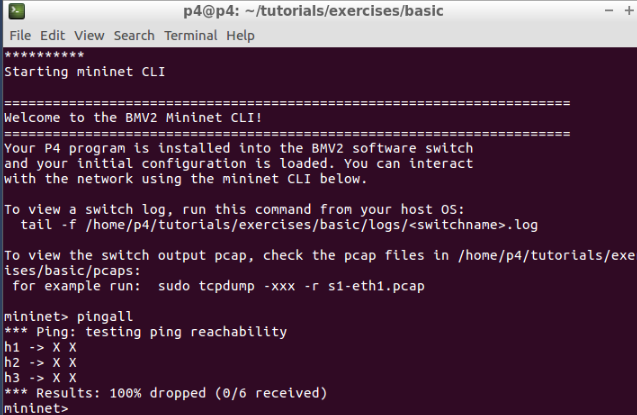
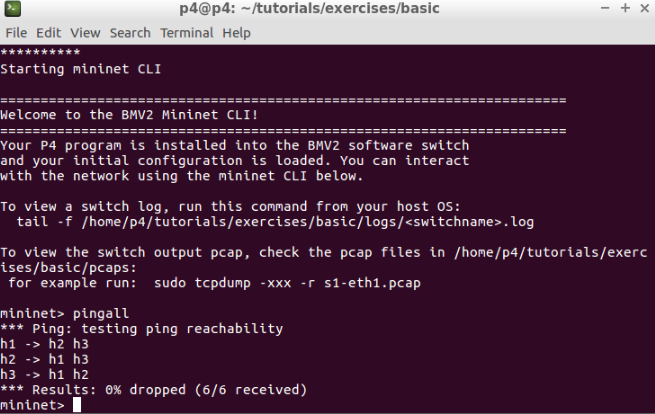
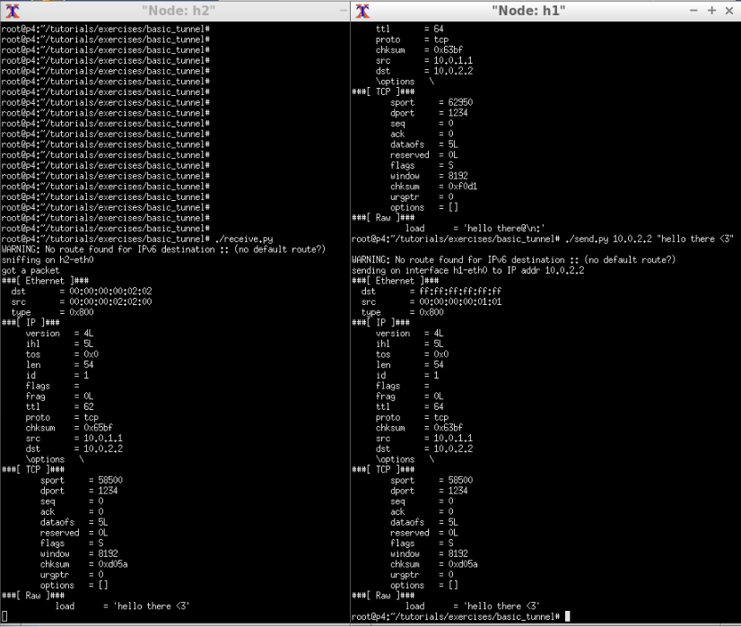
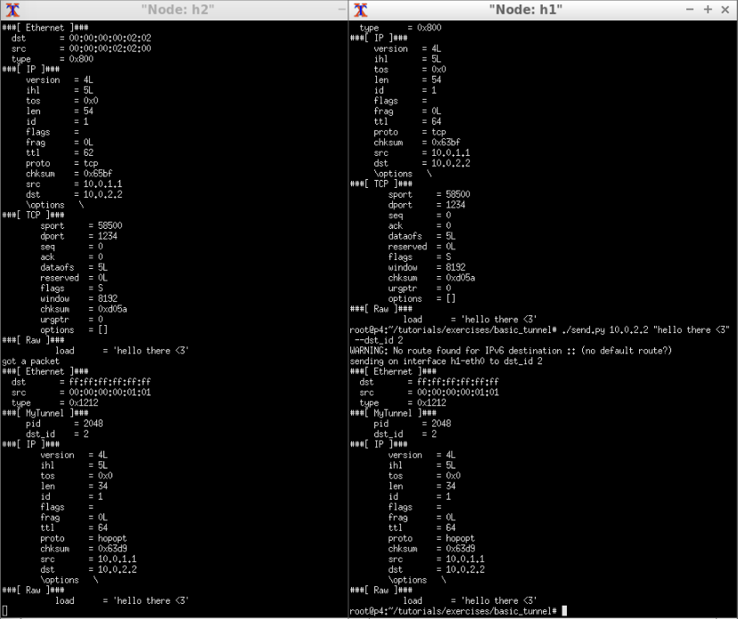
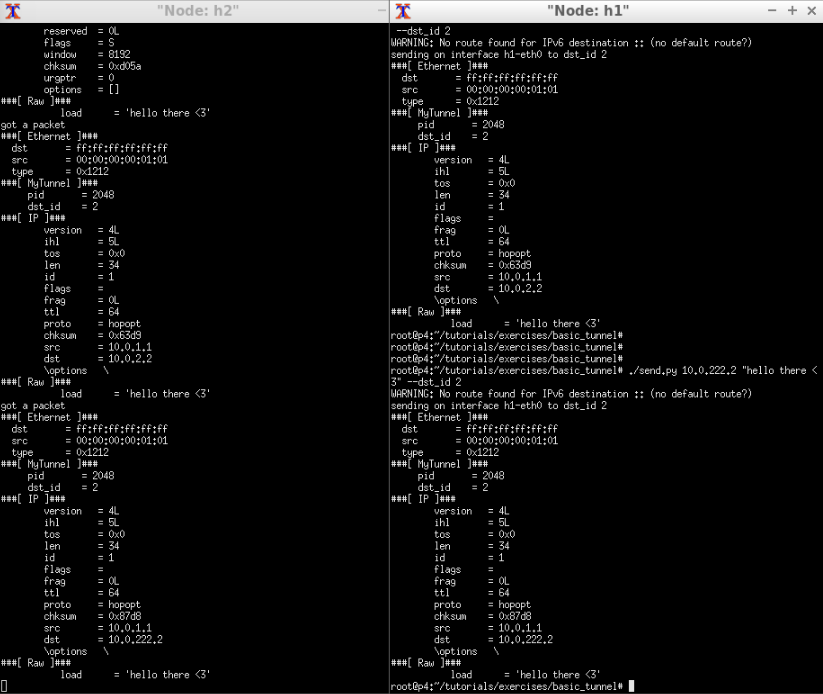

University: [ITMO University](https://itmo.ru/ru/)  
Faculty: [FICT](https://fict.itmo.ru)  
Course: [Network programming](https://github.com/itmo-ict-faculty/network-programming)  
Year: 2024/2025  
Group: K34212  
Author: Polina Zvoda  
Lab: Lab4  
Date of create: 16.12.2024  
Date of finished: 22.12.2024

## Лабораторная работа №4 "Базовая 'коммутация' и туннелирование используя язык программирования P4"

### Описание

В данной лабораторной работе вы познакомитесь на практике с языком программирования P4, разработанный компанией Barefoot (ныне Intel) для организации процесса обработки сетевого трафика на скорости чипа. Barefoot разработал несколько FPGA чипов для обработки трафика которые были встроенны в некоторые модели коммутаторов Arista и Brocade.

### Цель работы

Изучить синтаксис языка программирования P4 и выполнить 2 задания обучающих задания от Open network foundation для ознакомления на практике с P4.

---

### Ход работы

> Поднятие виртуальной машины

1. Скачиваем шаблон конфигурации `P4 Tutorial`
2. В VirtualBox через импорт конфигурации создаеам виртуальную машину
3. Запускаем нашу ВМ и смотрим, что все прошло прекрасно:

> Реализация базовой переадресации

1. Убедимся, что изначально пинг не поддерживается. Для этого запустим mininet и выполним команду make run.



2. В файле `basic.p4` внесем изменения:

Добавим парсинг `ethernet` и `ipv4 headers`.

```c
/*************************************************************************
*********************** P A R S E R  ***********************************
*************************************************************************/

parser MyParser(packet_in packet,
                out headers hdr,
                inout metadata meta,
                inout standard_metadata_t standard_metadata) {

    state start {
        transition parse_ethernet;
    }

    state parse_ethernet {
        packet.extract(hdr.ethernet);
        transition select(hdr.ethernet.etherType) {
            TYPE_IPV4 : parse_ipv4;
            default : accept;
        }
    }

    state parse_ipv4 {
        packet.extract(hdr.ipv4);
        transition accept;
    }
}
```

В разделе Ingress processing добавлен метод, отвечающий за пересылку пакетов, а также условие для проверки заголовков `ipv4 headers`.

```c
/*************************************************************************
**************  I N G R E S S   P R O C E S S I N G   *******************
*************************************************************************/

control MyIngress(inout headers hdr,
                  inout metadata meta,
                  inout standard_metadata_t standard_metadata) {
    action drop() {
        mark_to_drop(standard_metadata);
    }

    action ipv4_forward(macAddr_t dstAddr, egressSpec_t port) {
        standard_metadata.egress_spec = port;
        hdr.ethernet.srcAddr = hdr.ethernet.dstAddr;
        hdr.ethernet.dstAddr = dstAddr;
        hdr.ipv4.ttl = hdr.ipv4.ttl - 1;
    }

    table ipv4_lpm {
        key = {
            hdr.ipv4.dstAddr: lpm;
        }
        actions = {
            ipv4_forward;
            drop;
            NoAction;
        }
        size = 1024;
        default_action = NoAction();
    }

    apply {
        if (hdr.ipv4.isValid()) {
            ipv4_lpm.apply();
        }
    }
}
```

В разделе Deparsers добавлена логика депарсинга `ethernet` и `ipv4 headers`.

```c
/*************************************************************************
***********************  D E P A R S E R  *******************************
*************************************************************************/

control MyDeparser(packet_out packet, in headers hdr) {
    apply {
        packet.emit(hdr.ethernet);
        packet.emit(hdr.ipv4);
    }
}
```

3.  Перезапустим mininet и убедимся, что пинг работает на всех коммутаторах.



> Реализация базового туннелирования

1. В файле `basic_tunnel.p4` внесем изменения:

Проверим заголовок `header myTunnel_t`, который содержит идентификатор протокола и коммутатора приёма.

```c
const bit<16> TYPE_MYTUNNEL = 0x1212;
const bit<16> TYPE_IPV4 = 0x800;

/*************************************************************************
*********************** H E A D E R S  ***********************************
*************************************************************************/

typedef bit<9>  egressSpec_t;
typedef bit<48> macAddr_t;
typedef bit<32> ip4Addr_t;

header ethernet_t {
    macAddr_t dstAddr;
    macAddr_t srcAddr;
    bit<16>   etherType;
}

header myTunnel_t {
    bit<16> proto_id;
    bit<16> dst_id;
}

header ipv4_t {
    bit<4>    version;
    bit<4>    ihl;
    bit<8>    diffserv;
    bit<16>   totalLen;
    bit<16>   identification;
    bit<3>    flags;
    bit<13>   fragOffset;
    bit<8>    ttl;
    bit<8>    protocol;
    bit<16>   hdrChecksum;
    ip4Addr_t srcAddr;
    ip4Addr_t dstAddr;
}

struct metadata {
    /* empty */
}

struct headers {
    ethernet_t   ethernet;
    myTunnel_t   myTunnel;
    ipv4_t       ipv4;
}
```

В разделе Parsers добавим состояние `state parse_myTunnel` и включим его в оператор `select`.

```c
/*************************************************************************
*********************** P A R S E R  ***********************************
*************************************************************************/

parser MyParser(packet_in packet,
                out headers hdr,
                inout metadata meta,
                inout standard_metadata_t standard_metadata) {

    state start {
        transition parse_ethernet;
    }

    state parse_ethernet {
        packet.extract(hdr.ethernet);
        transition select(hdr.ethernet.etherType) {
            TYPE_IPV4 : parse_ipv4;
            TYPE_MYTUNNEL : parse_myTunnel;
            default : accept;
        }
    }

    state parse_ipv4 {
        packet.extract(hdr.ipv4);
        transition accept;
    }

    state parse_myTunnel {
        packet.extract(hdr.myTunnel);
        transition select(hdr.myTunnel.proto_id) {
            TYPE_IPV4 : parse_ipv4;
            default : accept;
        }
    }

}
```

В разделе Ingress processing добавим новое действие `action myTunnel_forward(egressSpec_t port)` и новую таблицу `table myTunnel_exact`. Также реализуем условие проверки: если IP указан корректно, но туннель отсутствует, отправляем пакеты без туннеля; если всё указано правильно, используем туннель.

```c
/*************************************************************************
**************  I N G R E S S   P R O C E S S I N G   *******************
*************************************************************************/

control MyIngress(inout headers hdr,
                  inout metadata meta,
                  inout standard_metadata_t standard_metadata) {
    action drop() {
        mark_to_drop(standard_metadata);
    }

    action ipv4_forward(macAddr_t dstAddr, egressSpec_t port) {
        standard_metadata.egress_spec = port;
        hdr.ethernet.srcAddr = hdr.ethernet.dstAddr;
        hdr.ethernet.dstAddr = dstAddr;
        hdr.ipv4.ttl = hdr.ipv4.ttl - 1;
    }


    table ipv4_lpm {
        key = {
            hdr.ipv4.dstAddr: lpm;
        }
        actions = {
            ipv4_forward;
            drop;
            NoAction;
        }
        size = 1024;
        default_action = drop();
    }

    action myTunnel_forward(egressSpec_t port) {
        standard_metadata.egress_spec = port;
    }

    table myTunnel_exact {
        key = {
            hdr.myTunnel.dst_id: exact;
        }
        actions = {
            myTunnel_forward;
            drop;
            NoAction;
        }
        size = 1024;
        default_action = NoAction();
    }

    apply {
        if (hdr.ipv4.isValid() && !hdr.myTunnel.isValid()) {
            ipv4_lpm.apply();
        }
        if (hdr.myTunnel.isValid()) {
            myTunnel_exact.apply();
        }
    }
}
```

В разделе Deparsers добавим преобразование пакетов для туннелирования.

```c
/*************************************************************************
***********************  D E P A R S E R  *******************************
*************************************************************************/

control MyDeparser(packet_out packet, in headers hdr) {
    apply {
        packet.emit(hdr.ethernet);
        packet.emit(hdr.myTunnel);
        packet.emit(hdr.ipv4);
    }
}
```

2. Проверим корректность работы без туннелирования



3. Проверим корректность работы с туннелированием



4. Проверим работу проверки IP



### Вывод

В рамках данной работы были реализованы базовая переадресация и туннелирование с использованием языка P4.
